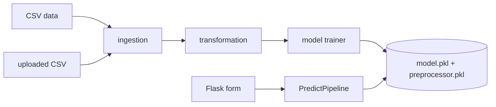

# End-to-End Intelligent Inventory Management System

A backorder-prediction web app: given inventory and sales figures for a product, it predicts whether the product will go on backorder, and lets users upload their own dataset to retrain the model.

## Features
- Modular ML pipeline: data ingestion (train/test split), transformation (median imputation, StandardScaler, resampling for class imbalance, 3-sigma outlier removal), model trainer (Random Forest, Decision Tree, SGD, KNN, Gradient Boosting; best chosen by F1-score).
- Flask web UI: single-product prediction (`/`), custom-dataset upload and retraining (`/train_custom_data`), and `/predict` (see `app.py`).
- Seven input features: `national_inv`, `lead_time`, `in_transit_qty`, `forecast_3_month`, `sales_1_month`, `min_bank`, `perf_6_month_avg`.
- Custom logging with timestamped files and custom exceptions.
- Documentation PDFs (architecture, HLD, LLD, wireframe, report) and a demo video; screenshots and an architecture diagram in `artifacts/`.
- AWS Elastic Beanstalk config; the README states the AWS deployment is no longer active.

## Flow


## Tech stack
Python, pandas, NumPy, scikit-learn, seaborn, Flask, Werkzeug, AWS Elastic Beanstalk.

## Structure
```
app.py / application.py   # Flask apps (the two differ; application.py is the EB entry point and serves form.html)
src/components/  src/pipelines/  src/{logger,exception,utils}.py
notebooks/back_order_predict.ipynb   # EDA and experiments
artifacts/   templates/   uploads/   Documentation/   logs/
```

## Run
```bash
pip install -r requirements.txt
python app.py        # http://localhost:5000
```
Programmatic training: `Training_Pipeline().initiate_training_pipeline()` from `src/pipelines/training_pipeline.py`.

## Limitations / future work
No metrics are published in the repo; no API endpoints; hyper-parameter tuning not done; Flask `secret_key` is a placeholder; two diverging entry points; sample uploads, logs and large binaries are committed.
